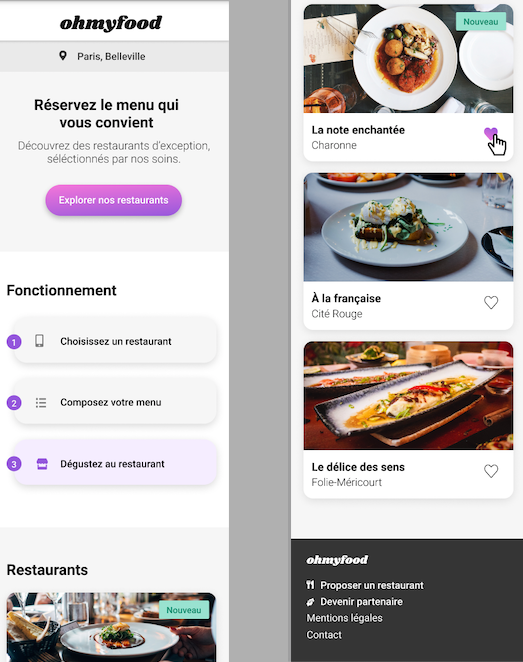
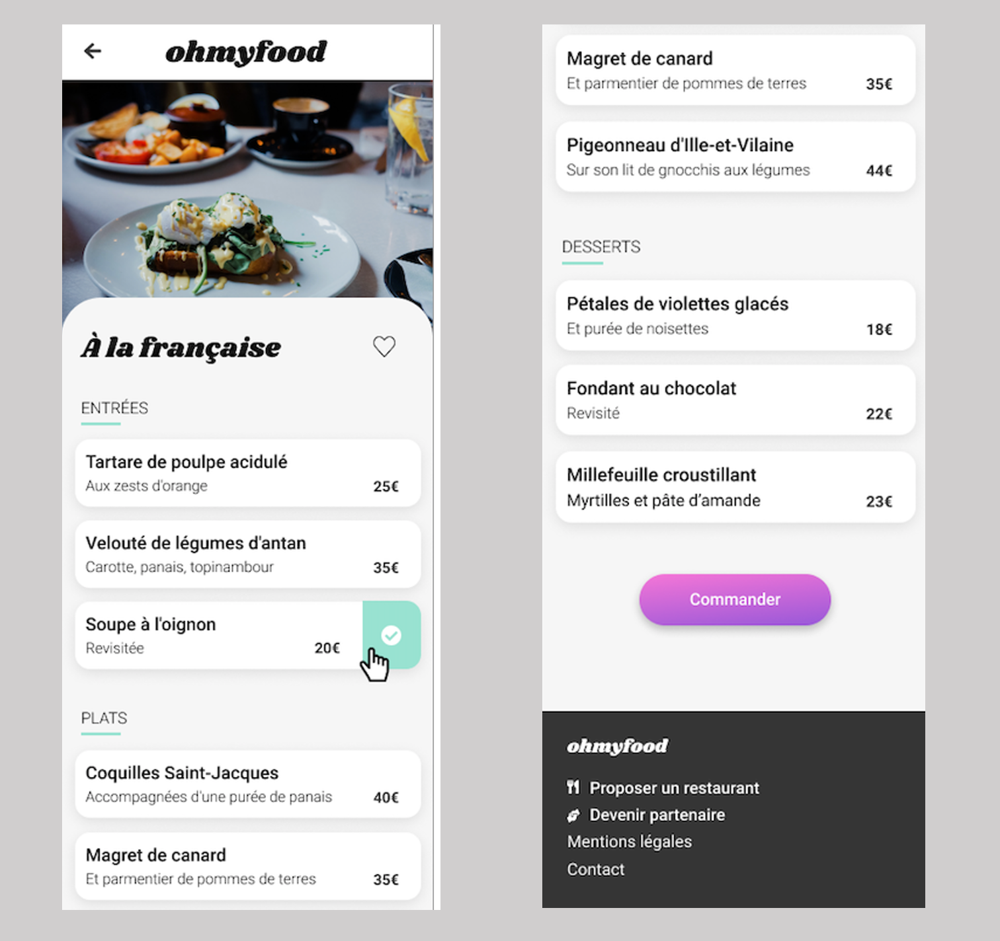

  

# Ohmyfood

## Description

Projet 3 du parcours développeur Front-end chez Openclassrooms qui a pour objectif d’intégrer la maquette du site Ohmyfood  qui est un site 100% mobile qui répertorie les menus de restaurants gastronimique. Les usagers pourront réserver mais aussi composer leur menu pour que les plats soient prêts à leur arrivée.

## Maquette mobile de la page d'accueil

## Maquette mobile d'une des pages menu

## Éléments fournis par l’entreprise virtuelle

- La maquette mobile de la page d’accueil et des 4 pages restaurant
- Les images des maquettes 
- Exemples d’animation fournis
- Un brief créatif (description de la marque, enjeux, fonctionnement, livrables attendus) 
- Les couleurs de la charte sont : Primaire #9356DC, Secondaire #FF79DA et Tertiaire #99E2D0
- La police du site est Shrikhand pour le logo et les titres et Roboto pour le reste.

## Cahier des charges

- Le développement devra se faire en CSS, sans JavaScript
- Aucun framework ne devra être utilisé, en revanche l’utilisation de SASS serait un plus
- Aucun code CSS ne devra être appliqué via un attribut style dans une balise HTML
- L’ensemble du site devra être responsive sur mobile, tablette et desktop
- Le code ne doit avoir aucune erreur ni alerte au validateur W3C HTML et CSS
- Le site devra être compatible avec Chrome et Firefox

## Contenu des pages

### Page d’accueil (X1)

- Affichage de la localisation des restaurants. A terme il sera possible de choisir sa localisation pour trouver des restaurants proches d’un certain lieu.
- Une course présentation de l’entreprise.
- Une section contenant les 4 menus sous forme cartes. Au clic sur la carte, l’utilisateur est redirigé vers la page du menu.
- Un “loading spinner” sera nécessaire. Il devra apparaitre pendant 1 à 3 secondes quand on arrive sur la page d'accueil, couvrir l'intégralité́ de l'écran, et utiliser les animations CSS (pas de librairie). Le design de ce loader n’est pas défini, toute proposition est donc la bienvenue tant qu’elle est cohérente avec la charte graphique du site. 

### Page de menu (X4)

- 4 pages contenant chacune le menu d’un restaurant.
- À l’arrivée sur la page, les plats devront apparaitre progressivement avec un léger décalage dans le temps. Ils pourront soit apparaitre un par un, soit par groupe “Entrée”, “Plat” et “Dessert”. Un exemple de l’effet attendu est fourni. 
- Le visiteur peut ajouter les plats qu'il souhaite à sa commande en cliquant dessus. Cela fait apparaitre une petite coche à droite du plat. Cette coche devra coulisser de la droite vers la gauche. Pour cette première version, l’effet peut apparaitre au survol sur desktop au lieu du clic. Si l’intitulé du plat est trop long, il devra être rogné avec des points de suspension. Un exemple de l’effet attendu est fourni. 

### Header

- Le header est identique sur toutes les pages.
- Sur la page d’accueil, il contient le logo du site.
- Sur les pages de menu, il contient en plus un bouton de retour vers la page d’accueil.

### Footer

- Le footer est identique sur toutes les pages.
- Au clic sur « contact », un renvoi vers une adresse mail est effectué.

### Boutons

- Au survol, la couleur de fond des boutons principaux devra légèrement s’éclaircir. L’ombre portée devra également être plus visible.
- À terme, les visiteurs pourront sauvegarder leurs menus préférés. Pour ça, un bouton "J’aime" en forme de cœur est présent sur la maquette. Au clic, il devra se remplir progressivement. Pour cette première version, l’effet peut être apparaitre au survol sur desktop au lieu du clic. 

## Outils utilisés

- Visual Studio Code avec les plugins Live server et Live compilation Sass
- Git
- GitHub pour le versionning
- Heberger le site sur GitHub Pages